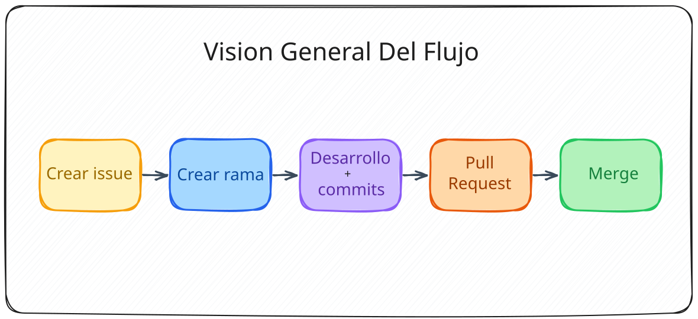

<div align="center">

# 🤝 Guía de Contribución - Cuadernillos Municipales


---

### Todo cambio en producción empieza con un issue. 🎯

</div>

---

## Índice

- [Visión General del Flujo](#visión-general-del-flujo)
- [Issues](#issues)
- [Convenciones de Commits](#convenciones-de-commits)
- [Pull Requests](#pull-requests)
- [Board del Proyecto](#board-del-proyecto)
- [Code Review](#code-review)
- [Lo que NO hacer](#lo-que-no-hacer)

---

## Visión General del Flujo

El flujo de trabajo se resume en el siguiente diagrama:



Esencialmente los pasos son los siguientes:

**1. Issue**<br/>
Describe el problema o feature con contexto y criterios de aceptación.

**2. Branch**<br/>
Crea una rama desde `develop` con el nombre convencional.

**3. Commits**<br/>
Crea los commits siguiendo la convención de [nuestra guía de commits](docs/commit-conventions.md).

**4. PR**<br/>
Abre el PR hacia `develop`, agrega contexto y solicita revisión.

---

## Issues

### ¿Cuándo crear un issue?

Siempre. Antes de tocar código, debe existir un issue que justifique el cambio.

<table>
<tr>
<td>

**Crea un issue para:**
- Bugs y comportamientos inesperados
- Nuevas secciones (pipelines) o features
- Mejoras a la documentación
- Refactorizaciones o deuda técnica
- Ideas o propuestas de mejora

</td>
<td>

**Un buen issue incluye:**
- Descripción clara del problema o feature
- Pasos para reproducir (si es bug)
- Criterios de aceptación
- Contexto adicional (logs, screenshots, PDF de referencia)
- Labels apropiados

</td>
</tr>
</table>

### Plantilla recomendada

```markdown
## Descripción
¿Qué está pasando o qué se necesita?

## Criterios de Aceptación
- [ ] La sección X genera correctamente sus gráficas
- [ ] El template LaTeX compila sin errores
- [ ] El context dict no colisiona con otras secciones

## Contexto adicional
Logs, screenshots, PDF de referencia del IIEG, etc.
```

---

## Convenciones de Commits

Usamos **Conventional Commits** con scope específico al proyecto (`feat(demografia)`, `fix(core)`, `docs(commits)`...).

> Guía completa con tipos, scopes y ejemplos en nuestra **[guía de convención de commits](docs/commit-conventions.md)**.

---

## Pull Requests

### Checklist antes de abrir un PR

```markdown
### Código
- [ ] El pipeline corre con `just run-one <municipio_id>` sin errores
- [ ] El PDF generado compila con `pdflatex`
- [ ] Cada sección implementa el contrato `Section` (`Extract` + `Analizer`)
- [ ] Los keys del context dict NO colisionan entre secciones
- [ ] No hay credenciales ni archivos `.env` en el PR

### Datos y formato
- [ ] Los valores numéricos respetan el formato NOM-008 (2 decimales, espacio fino)
- [ ] Los valores ausentes usan el macro `\ND`, nunca celdas vacías
- [ ] Las tablas usan `longtable` según las reglas de templates LaTeX

### Documentación
- [ ] El README de la sección está actualizado (si aplica)
- [ ] Las variables de entorno están documentadas en un `.env.example`
```

### Plantilla de descripción

```markdown
## ¿Qué hace este PR?
Descripción breve del cambio.

## ¿Por qué?
Contexto del issue que resuelve. Closes #<número>

## Cambios principales
- Agrega stage Extract para la sección X
- Agrega gráficas en charts/
- Actualiza el template sections/seccion_N.tex.j2

## Cómo probar
1. `uv sync`
2. `just run-one <municipio_id>`
3. Revisar el PDF en `output/pdf/`

## Screenshots / PDF (opcional)
```

### Reglas del PR

<table>
<tr>
<td>

**El PR debe:**
- Apuntar a `develop` (no a `main`)
- Referenciar el issue: `Closes #42`
- Tener descripción clara de los cambios
- Tener al menos **1 aprobación** antes de merge
- Pasar todos los checks del CI

</td>
<td>

**El PR NO debe:**
- Incluir archivos `.env` ni credenciales
- Mezclarse con cambios no relacionados
- Tener más de ~500 líneas de cambio (dividir si es necesario)
- Mergear sin revisión
- Incluir commits `WIP` o de debug

</td>
</tr>
</table>

---

## Board del Proyecto

El board de GitHub Projects organiza el trabajo en columnas:

| Columna | Qué va aquí |
|:-------:|:------------|
| **Backlog** | Issues identificados, sin prioridad aún |
| **To Do** | Issues priorizados para el sprint actual |
| **In Progress** | Issues con trabajo activo (rama creada) |
| **In Review** | PRs abiertos esperando revisión |
| **Done** | Issues cerrados / PRs mergeados |

> Cuando creas una rama para un issue, mueve la tarjeta a **In Progress**.
> Cuando abres el PR, muévela a **In Review**.

---

## Code Review

### Como autor

- Asigna reviewers apenas abras el PR
- Responde todos los comentarios antes de solicitar re-review
- No hagas force push mientras hay una revisión activa
- Usa "Resolve conversation" solo cuando el cambio esté aplicado

### Como reviewer

- Revisa el PR en las primeras 24 horas
- Diferencia entre **bloqueantes** y **sugerencias** en tus comentarios

```
❌  "Esto está mal"
✅  "Considera centralizar el formateo en un helper `fmt()`: data-patterns.md"

❌  "No me gusta esta función"
✅  "Sugerencia (no bloqueante): podrías extraer esta lógica del Analizer a charts/ para facilitar el testing"
```

---

## Lo que NO hacer

> Estos puntos no son negociables. 🔒

<table>
<tr>
<td>

**Seguridad**
- ❌ Nunca subas contraseñas, tokens o API keys
- ❌ Nunca subas archivos `.env` con valores reales
- ❌ Nunca hardcodees credenciales de base de datos en el código
- ❌ Nunca hardcodees rutas absolutas locales

</td>
<td>

**Git**
- ❌ No hagas push directo a `main` o `develop`
- ❌ No uses `--force` en ramas compartidas
- ❌ No mergees tu propio PR sin revisión
- ❌ No borres ramas de otros sin consultar

</td>
</tr>
</table>

---

<div align="center">

<sub>Guía de contribución - Cuadernillos Municipales - IIEG Jalisco</sub>

</div>
