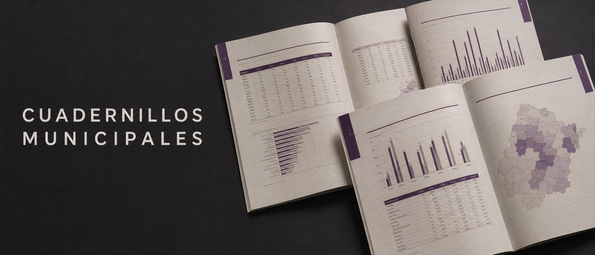
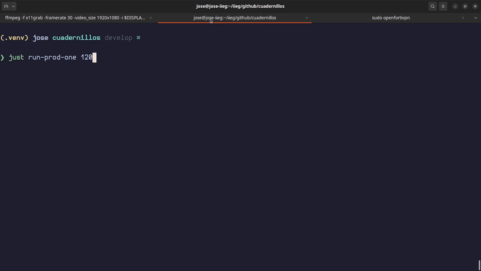

<p align="center">
  
</p>

<p align="center">
  Reportes estadísticos automatizados para los 125 municipios de Jalisco.
</p>

Los Cuadernillos Municipales son reportes estadísticos que el IIEG (Instituto de Información Estadística y Geográfica de Jalisco) publica para cada uno de los 125 municipios del estado. Cada cuadernillo concentra indicadores clave de historia, geografía, demografía, economía, gobierno y seguridad, y sirve como referencia oficial para la toma de decisiones en el ámbito municipal.

Este repositorio automatiza la generación de esos reportes: extrae datos de PostgreSQL, genera gráficas con matplotlib, renderiza templates Jinja2 LaTeX y compila con `xelatex`.

## Preview

<p align="center">
  
</p>

## Documentación

| Documento | Qué documenta |
|---|---|
| [Comandos just](docs/just.md) | Instalación de `just` y todas las recetas del `justfile`, agrupadas en preparación, desarrollo, producción y calidad |
| [Bases de datos](docs/databases.md) | Qué base usa cada sección, el archivo `.env` que le corresponde, cómo se abre la conexión, dónde viven las consultas y cómo diagnosticar fallas |
| [Templates LaTeX](docs/latex-templates.md) | Cómo pasar un documento de Overleaf a template Jinja2: delimitadores propios, convención de nombres de variables, paquetes disponibles, macros del proyecto y reglas de contenido |
| [Tablas](docs/tables.md) | La estructura de `longtable` que usan todas las tablas: proporciones y alineación de columnas, encabezados, caption, pie, tamaños de fuente, colores y formato de cifras |
| [Gráficas](docs/charts.md) | Cómo se insertan las gráficas, el título numerado con `\graficatitulo`, el pie de dos columnas con `\tablefooter` y el orden de nota y fuente |
| [Mapas](docs/maps.md) | Por qué los mapas no se insertan con `\includegraphics`, de dónde se descargan, la versión ligera para iterar, tamaño y posición, título, contador y pie |
| [Convención de commits](docs/commit-conventions.md) | Formato de los mensajes de commit, tipos válidos que valida el hook y scopes sugeridos |

Las reglas de estilo que aplican al contenido de los cuadernillos, formato de cifras y estructura de los templates viven en `.claude/rules/`.

## Quick start

### Requisitos

- Python 3.12+
- [uv](https://docs.astral.sh/uv/)
- [just](https://just.systems/)
- [pre-commit](https://pre-commit.com/)
- TeX Live con `xelatex`
- Fuentes Lexend y Garet (ver [Fuentes](#fuentes))
- Acceso a las bases de datos del IIEG (ver [Bases de datos](docs/databases.md))

### Instalación

Instala `just` siguiendo las instrucciones en [docs/just.md](docs/just.md), luego:

```bash
git clone git@github.com:iieg-oficial/cuadernillos.git
cd cuadernillos
just setup
```

### Fuentes

El proyecto usa dos familias tipográficas:

| Fuente | Dónde se usa | Cómo obtenerla |
|---|---|---|
| [Lexend](https://fonts.google.com/specimen/Lexend) | Todo el cuerpo del documento | Google Fonts |
| Garet | Portadas: general y de cada sección | Licencia del IIEG; pídela al equipo de diseño |

Ambas se cargan por ruta desde `FONTS_PATH`, no por nombre de sistema, así que basta con dejar los
archivos ahí. De Garet hacen falta los pesos **Extra Bold** y **Medium**:

```bash
cp Garet-Extra-Bold.otf Garet-Medium.otf ~/.fonts/
```

Los nombres de archivo están escritos en `templates/base.tex.j2`; si tu copia de Garet los nombra
distinto, ajústalos ahí.

Para Lexend, descarga los pesos Light, Medium, SemiBold, Bold y ExtraBold:

```bash
wget -O /tmp/lexend.zip "https://fonts.google.com/download?family=Lexend"
unzip /tmp/lexend.zip -d /tmp/lexend

mkdir -p ~/.fonts
cp /tmp/lexend/static/*.ttf ~/.fonts/

fc-cache -fv
```

### Variables de entorno

Copia los archivos de ejemplo en `.env.example/` a `.env/` y llena las credenciales:

```bash
cp .env.example/.env.fiscalia.example .env/.env.fiscalia
# ... repite para cada base de datos
```

Cada base de datos tiene su propio archivo; ver [Bases de datos](docs/databases.md). Además de las credenciales, hay variables que configuran el documento:

| Archivo | Variable | Para qué sirve |
|---|---|---|
| `.env/.env.app` | `FONTS_PATH` | Ruta donde quedó instalada la fuente Lexend (por ejemplo `~/.fonts/`) |
| `.env/.env.app` | `ESCUDOS_URL` | ZIP de Drive con los escudos municipales |
| `.env/.env.demografia` | `DEMOGRAFIA_MAPS_*_URL` | Carpetas de Drive con los mapas de demografía |
| `.env/.env.geografia` | `GEOGRAFIA_MAPS_FOLDER_URL` | Carpeta de Drive con los mapas de geografía |

### Recursos que se descargan solos

En la primera corrida el pipeline descarga desde Google Drive lo que falte, y no vuelve a hacerlo si ya está en disco:

| Recurso | Destino |
|---|---|
| Escudos municipales | `assets/escudos_mun_jal/` |
| Mapas de demografía | `assets/maps/demografia/` |
| Mapas de geografía | `assets/maps/geografia/` |

Los tres directorios están en `.gitignore`: son insumos, no código.

### Generar cuadernillos

Ver [docs/just.md](docs/just.md) para la lista completa de comandos.

Hay dos modos de generación:

| Modo | Comando | Salida | xelatex |
|---|---|---|---|
| Desarrollo | `just run`, `just run-one <clave>` | `output/pdf/{clave}_{nombre}_cuadernillo_municipal_2026/` | una pasada |
| Final | `just prod-run [clave]`, `just prod-run-range <desde> <hasta>`, `just prod-run-one <clave>` | `output/pdf/prod/` y `output/tex/prod/` | dos pasadas |

El modo de desarrollo corre xelatex una sola vez y deja los archivos auxiliares junto al PDF: es más
rápido para iterar, pero el índice y las referencias cruzadas quedan sin resolver en una corrida
limpia. El modo final hace las dos pasadas que LaTeX necesita y escribe los auxiliares en un
directorio temporal, de modo que en `output/pdf/prod/` solo quedan los PDFs.

En desarrollo cada cuadernillo deja su `.tex` en su propia carpeta bajo `output/tex/`.

En modo final, `output/tex/prod/{slug}/` es un **paquete autocontenido**: el `.tex`, las tipografías,
los mapas, las gráficas y los logos que usa, con las rutas relativas a esa carpeta. Se comprime, se
sube a Overleaf y compila sin tocar nada; trae un `latexmkrc` que ya deja seleccionado XeLaTeX y un
`LEEME.md` con los pasos. Es también lo que se compila localmente, así que si el PDF sale aquí, sale
allá.

El nombre del archivo se arma con la clave y el municipio sin acentos y en minúsculas
(`27_cuautitlan_de_garcia_barragan_cuadernillo_municipal_2026`), para que sea ASCII puro y no dé
problemas al moverlo entre sistemas.

Los `.tex` no son portables por sí solos: referencian mapas, gráficas y escudos por ruta relativa a la raíz del repositorio, y las fuentes por ruta absoluta.

## Contributing

Todo cambio en producción empieza con un issue. El flujo completo (issues, convención de commits,
plantilla y reglas de los pull requests, board del proyecto y code review) está en
[CONTRIBUTING.md](CONTRIBUTING.md).

Antes de abrir un PR:

```bash
just lint
just test
```

## License

El repositorio tiene dos licencias, una para el código y otra para lo que el código produce:

| Qué | Licencia |
|---|---|
| Código fuente (`core/`, `pipelines/`, `templates/`, `main.py`) | [MIT](LICENSE) |
| Cuadernillos generados, catálogos de `assets/catalogs/` y documentación de `docs/` | [CC BY 4.0](LICENSE-DATA) |

Quedan fuera de ambas: la fuente **Garet**, licenciada al IIEG y no redistribuible, y los escudos
municipales y mapas que se descargan en tiempo de ejecución, sujetos a los términos de sus fuentes.
